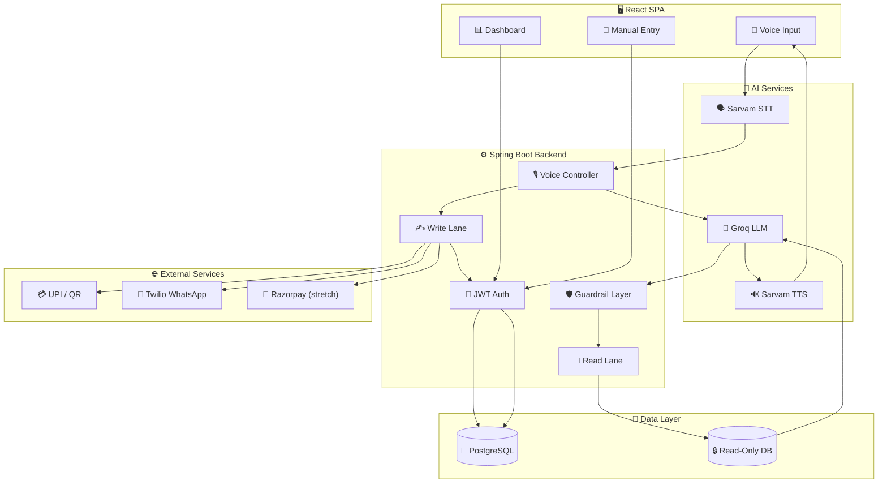
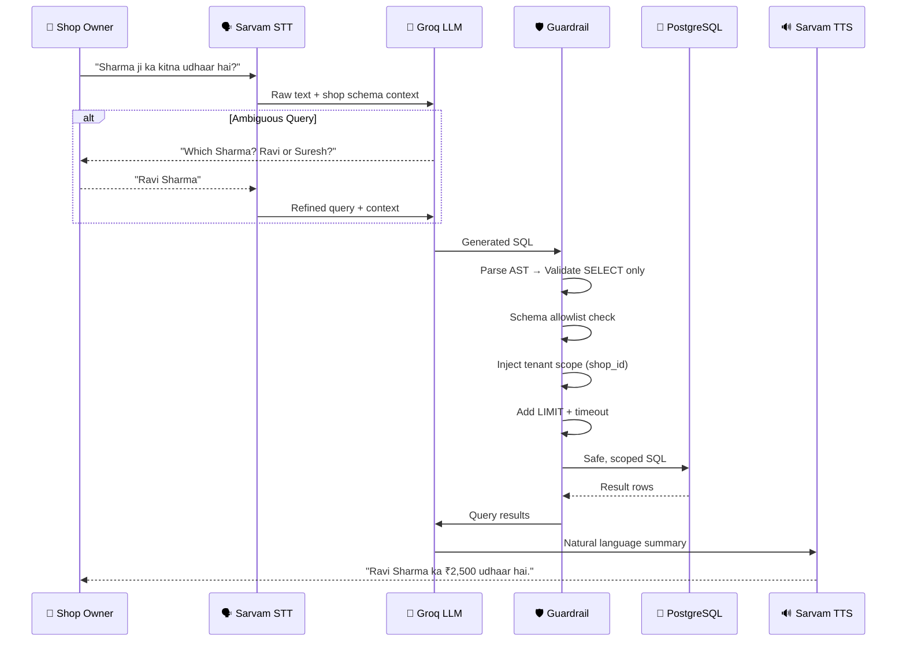
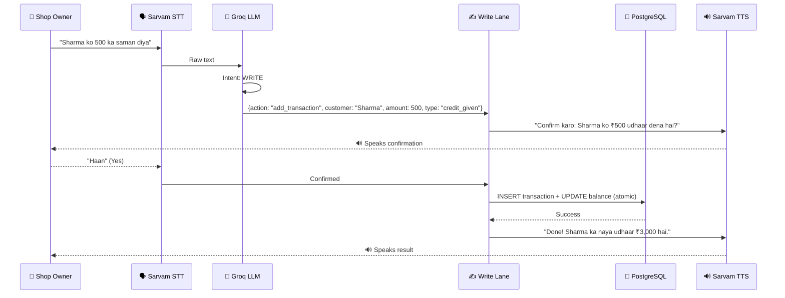
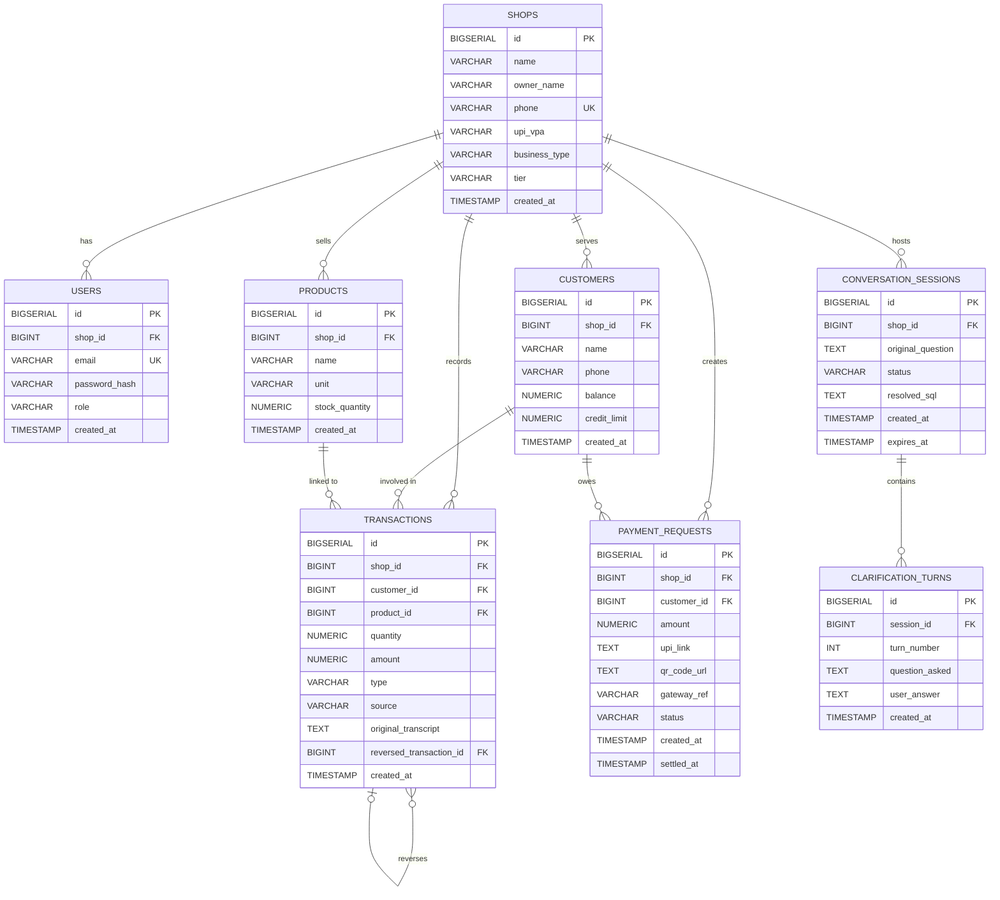
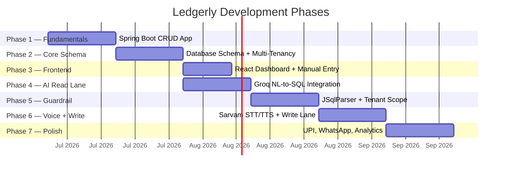

<div align="center">

# 🎙️ Ledgerly

### *Talk it. Track it.*

**An AI-powered voice copilot that turns natural language into safe, sandboxed SQL — built for India's small business owners.**

---

[](https://openjdk.org/projects/jdk/17/)
[](https://spring.io/projects/spring-boot)
[](https://react.dev/)
[](https://www.postgresql.org/)
[](LICENSE)
[](https://github.com/ArpanMukherjee/ledgerly/pulls)

</div>

---

## 📖 Overview

Ledgerly is a **multi-tenant SaaS platform** designed for small business owners in India — kirana stores, clinics, tailors, and small shops. It replaces the traditional handwritten **khata** (ledger book) with a voice-first digital experience, enabling shopkeepers to:

- 🗣️ **Speak** transactions into existence in Hindi, English, or Hinglish
- 🧠 **Ask** natural language questions about their business data
- 💰 **Collect** payments via UPI links and QR codes
- 📊 **Understand** their business through analytics dashboards
- 📱 **Remind** customers about overdue balances via WhatsApp

> *"Sharma ji ka kitna udhaar hai?"* — and Ledgerly speaks back the answer.

---

## 🏗️ Architecture

### High-Level System Architecture



---

### Read Path — Voice Query Flow



---

### Write Path — Voice Transaction Flow



---

### Guardrail Layer — 7-Step Safety Pipeline

```mermaid
flowchart LR
    A["1️⃣ Parse SQL to AST"] --> B["2️⃣ Statement Type Check<br/>(SELECT only)"]
    B --> C["3️⃣ Schema Allowlist<br/>(tables/columns)"]
    C --> D["4️⃣ Inject Tenant Scope<br/>(shop_id = ?)"]
    D --> E["5️⃣ Add LIMIT + Timeout"]
    E --> F["6️⃣ Execute on<br/>Read-Only DB"]
    F --> G["7️⃣ Return Results<br/>or Structured Error"]

    style A fill:#e1f5fe
    style B fill:#fff3e0
    style C fill:#e8f5e9
    style D fill:#fce4ec
    style E fill:#f3e5f5
    style F fill:#e0f2f1
    style G fill:#fff8e1
```



> **Defense in depth:** Even if the LLM generates malicious SQL, the guardrail catches it at the parser level. Tenant scope is injected programmatically — never trusted from the LLM.

---

## 🧩 Database Schema



---

## ✨ Features

| Module | Features | Status |
|--------|----------|--------|
| 🎙️ **Voice Ledger Core** | NL-to-SQL read queries, voice write actions, multi-turn clarification, undo/correct via voice | 🚧 Planned |
| 💳 **Payments Layer** | UPI deep links, QR code generation, manual settlement, Razorpay sandbox (stretch) | 🚧 Planned |
| 📦 **Inventory** | Products per shop, stock tracking, negative-stock prevention | 🚧 Planned |
| 📱 **Customer Engagement** | Overdue detection, WhatsApp reminders via Twilio, customer self-view, credit limits (stretch) | 🚧 Planned |
| 📊 **Business Insights** | Top debtors, sales trends, credit vs. payments, voice daily/weekly summaries, audit trail | 🚧 Planned |
| 🔐 **SaaS / Tenancy** | Multi-tenant isolation, JWT auth, tiered access (Free vs Pro) | 🚧 Planned |

---

## 🛡️ Security & Safety

| Principle | Implementation |
|-----------|---------------|
| **SELECT-only enforcement** | JSqlParser AST validation — no regex, no prompt-only trust |
| **Tenant isolation** | Mandatory `shop_id` injection at AST level + JWT scope |
| **Read-only sandbox** | Separate DB user with no INSERT/UPDATE/DELETE grants |
| **Write safety** | LLM never generates SQL for writes — structured JSON actions only |
| **Atomic transactions** | All balance operations wrapped in `@Transactional` methods |
| **Query limits** | Row LIMIT + `statement_timeout` on every AI query |
| **Audit trail** | Every write logged with timestamp, source, and voice transcript |

---

## 🗺️ Development Roadmap



---

## 🧰 Tech Stack

### Backend

| Layer | Technology | Purpose |
|-------|-----------|---------|
| Framework | Spring Boot 3.x (Java 17) | REST API, services, JPA |
| ORM | Spring Data JPA + Hibernate | Entity CRUD |
| SQL Validation | JSqlParser | Guardrail AST parsing |
| Database | PostgreSQL | Primary data store |
| Auth | Spring Security + JWT | Tenant-scoped authentication |

### Frontend

| Layer | Technology | Purpose |
|-------|-----------|---------|
| Framework | React | SPA |
| Charts | Recharts | Analytics dashboard |
| Bundler | Vite | Build tooling |

### External Services

| Service | Purpose |
|---------|---------|
| Groq API | LLM — SQL generation, intent extraction, summarization |
| Sarvam AI | Speech-to-text + Text-to-speech (Hindi/English/Hinglish) |
| Twilio WhatsApp | Payment reminders (sandbox) |
| Razorpay | Payment links (stretch feature) |

---

## 🚀 Getting Started

### Prerequisites

- Java 17+
- Maven 3.8+
- PostgreSQL 14+ (or MySQL 8+)
- Node.js 18+ & npm
- Git

### Backend Setup

```bash
# Clone the repository
git clone https://github.com/ArpanMukherjee/ledgerly.git
cd ledgerly

# Navigate to backend
cd backend

# Configure environment
cp .env.example .env
# Edit .env with your database credentials and API keys

# Run the application
mvn spring-boot:run
```

### Frontend Setup

```bash
# Navigate to frontend
cd frontend

# Install dependencies
npm install

# Start development server
npm run dev
```

### Environment Variables

```env
# Database
SPRING_DATASOURCE_URL=jdbc:postgresql://localhost:5432/ledgerly
SPRING_DATASOURCE_USERNAME=postgres
SPRING_DATASOURCE_PASSWORD=your_password

# AI Services
GROQ_API_KEY=your_groq_key
SARVAM_API_KEY=your_sarvam_key

# WhatsApp (Twilio)
TWILIO_ACCOUNT_SID=your_sid
TWILIO_AUTH_TOKEN=your_token

# Auth
JWT_SECRET=your_jwt_secret

# Payments (stretch)
RAZORPAY_KEY_ID=your_razorpay_key
RAZORPAY_KEY_SECRET=your_razorpay_secret
```

---

## 📂 Project Structure

```
ledgerly/
├── README.md
├── Ledgerly_SRS.md              # Full SRS document
├── PHASES.md                    # Development phases
│
├── backend/                     # Spring Boot application
│   ├── pom.xml
│   └── src/main/java/com/ledgerly/
│       ├── LedgerlyApplication.java
│       ├── controller/          # REST controllers
│       ├── service/             # Business logic
│       ├── repository/          # JPA repositories
│       ├── entity/              # JPA entities
│       ├── security/            # JWT + Spring Security
│       └── config/              # DataSource config
│
└── frontend/                    # React SPA
    ├── package.json
    └── src/
        ├── components/          # UI components
        ├── services/            # API layer
        └── ...
```

---

## 📊 API Endpoints

| Method | Endpoint | Description |
|--------|----------|-------------|
| `POST` | `/api/auth/signup` | Create shop + owner account |
| `POST` | `/api/auth/login` | Authenticate, return JWT |
| `POST` | `/api/voice/query` | Voice/text read query |
| `POST` | `/api/voice/action` | Voice/text write action |
| `POST` | `/api/voice/action/confirm` | Confirm/reject pending write |
| `GET` | `/api/customers` | List customers |
| `POST` | `/api/customers` | Add customer |
| `GET` | `/api/customers/{id}/history` | Transaction audit trail |
| `POST` | `/api/transactions` | Manual transaction entry |
| `POST` | `/api/payment-requests` | Generate UPI link/QR |
| `POST` | `/api/payment-requests/{id}/settle` | Mark payment settled |
| `GET` | `/api/dashboard/summary` | Analytics data |
| `GET` | `/api/products` | List inventory |
| `POST` | `/api/products` | Add/update product |
| `POST` | `/api/reminders/overdue` | Send WhatsApp reminders |

---

## 🤝 Contributing

Contributions are welcome! Please read our contributing guidelines before submitting a PR.

```bash
# Fork the repository
# Create your feature branch
git checkout -b feature/amazing-feature

# Commit your changes
git commit -m 'Add amazing feature'

# Push to the branch
git push origin feature/amazing-feature

# Open a Pull Request
```

---

## 📄 License

This project is licensed under the MIT License — see the [LICENSE](LICENSE) file for details.

---

## 👨‍💻 Author

**Arpan Mukherjee**

- 📧 [arpanmukherjee255@gmail.com](mailto:arpanmukherjee255@gmail.com)
- 🎓 DBMS Course Project — MCA, VIT Vellore

---

<div align="center">

### 🙏 Built with ❤️ for India's small business owners

**Ledgerly** — Because every rupee counts, and every voice matters.

</div>
