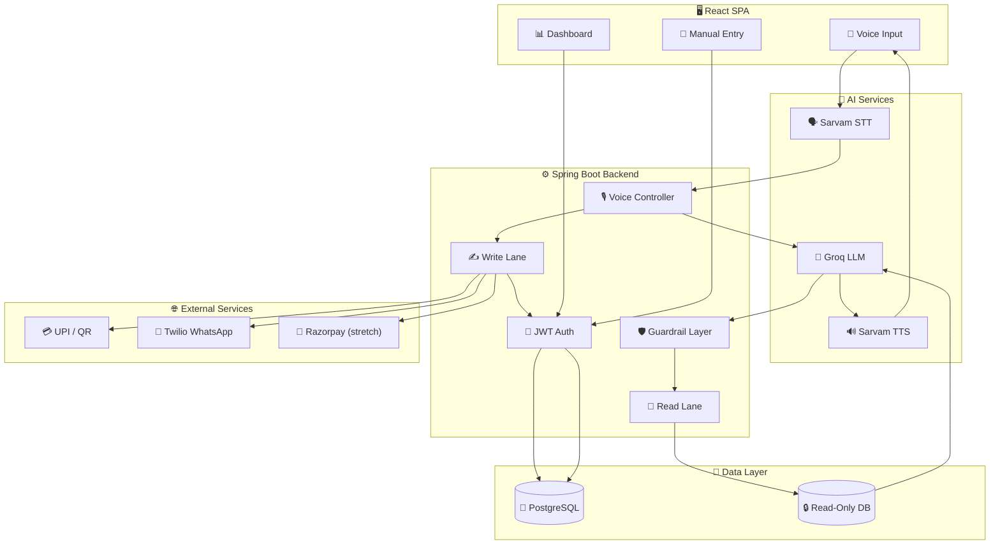
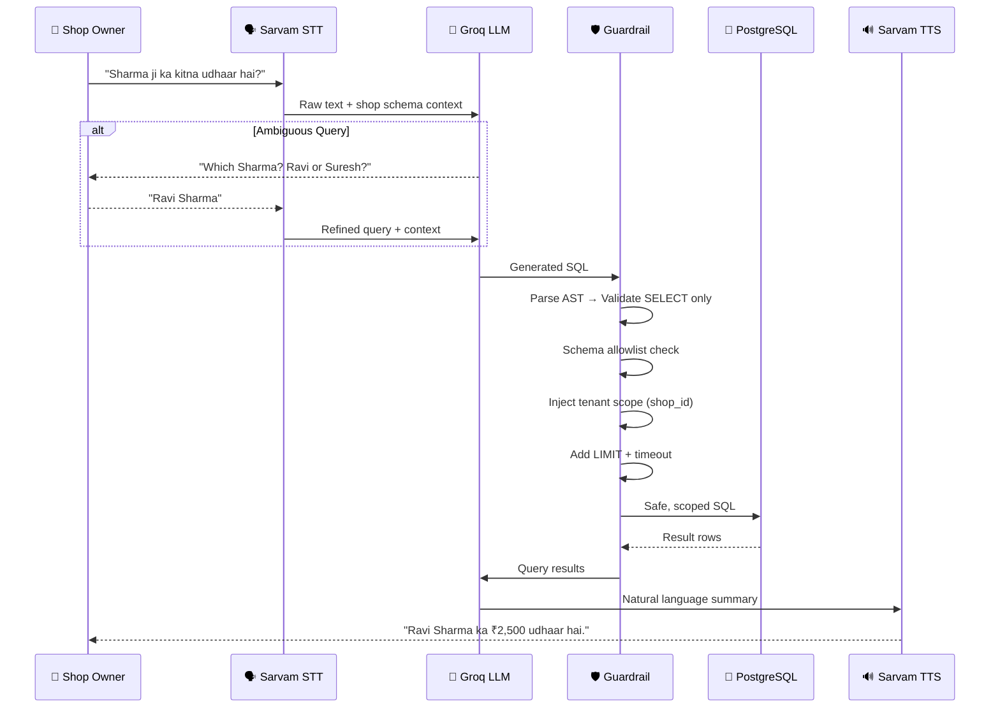
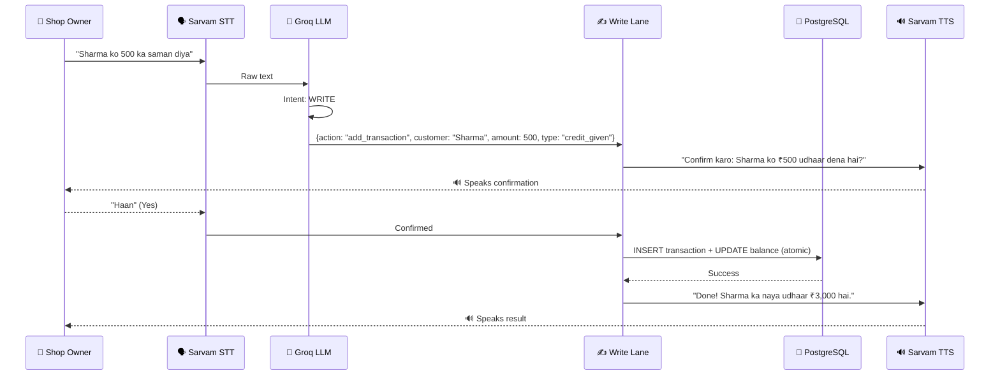
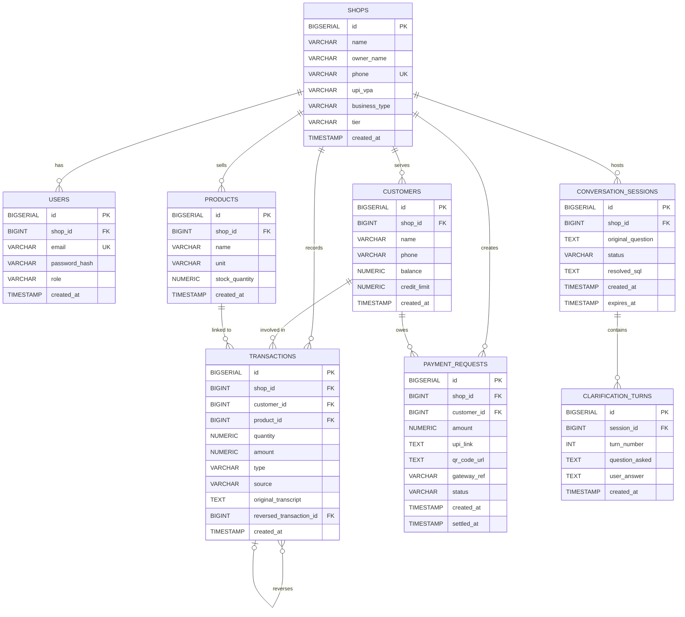
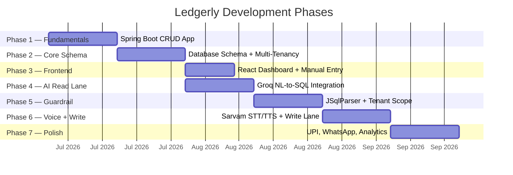

<div align="center">

# 🎙️ Ledgerly

### *Talk it. Track it.*

**An AI-powered voice copilot that turns natural language into safe, sandboxed SQL — built for India's small business owners.**

---

[](https://openjdk.org/projects/jdk/17/)
[](https://spring.io/projects/spring-boot)
[](https://react.dev/)
[](https://www.postgresql.org/)
[](LICENSE)
[](https://github.com/ArpanMukherjee/ledgerly/pulls)

</div>

---

## 📖 Overview

## 🤖 Connect Groq AI

The chat page sends authenticated requests to the backend at `POST /ai/chat`.
The Groq API key is only read by Spring Boot and is never exposed to the browser.

Create a `.env` file in the repository root (it is gitignored):

```env
GROQ_API_KEY=gsk_your_key_here
GROQ_MODEL=openai/gpt-oss-20b
```

Then start the backend:

```powershell
cd backend
.\mvnw.cmd spring-boot:run
```

Open http://localhost:8081/chat.html, log in, and send a message. The backend
uses a Ledgerly-specific system prompt and forwards the last ten chat messages
to Groq for conversational context.

For database questions, Groq receives the current `customers` schema and returns
structured JSON containing a PostgreSQL `SELECT` query. The backend validates the
query, allows access only to the `customers` table, applies a five-second timeout
and 100-row cap, executes it, and sends the SQL plus results back to the chat UI.
The UI renders a result table and a simple bar visualization when the response
contains suitable numeric columns. Writes are intentionally not enabled in this
path and the current schema does not yet contain balances or transactions.

The data model now covers real shop activity: customer contact/address details,
products and stock, sales, sale items with quantity and price, and payments.
Outstanding balances are derived from sales minus payments, while the original
ledger entries table remains available for simple credit/payment adjustments.
Natural-language writes are supported with confirmation. Requests such as
"add Ravi Sharma with phone 123", "Sharma bought 2 bags of rice at 500 each",
or "Sharma paid 200" are converted into an appropriate customer, product, sale,
sale-item, or payment statement, shown in the chat, and executed only after the
user clicks **Confirm database change**. A request to "close", "settle", or
"clear" a ledger records a payment and preserves history; explicit "delete" or
"remove" requests can generate a confirmed delete instead. Deleting a customer
with related sales or payments may be rejected by the database so transaction
history cannot be removed accidentally. Authentication tables and secrets are
never available to the AI query path.

Ledgerly is a **multi-tenant SaaS platform** designed for small business owners in India — kirana stores, clinics, tailors, and small shops. It replaces the traditional handwritten **khata** (ledger book) with a voice-first digital experience, enabling shopkeepers to:

- 🗣️ **Speak** transactions into existence in Hindi, English, or Hinglish
- 🧠 **Ask** natural language questions about their business data
- 💰 **Collect** payments via UPI links and QR codes
- 📊 **Understand** their business through analytics dashboards
- 📱 **Remind** customers about overdue balances via WhatsApp

> *"Sharma ji ka kitna udhaar hai?"* — and Ledgerly speaks back the answer.

---

## 🏗️ Architecture

### High-Level System Architecture


```mermaid
graph TB
    subgraph Frontend ["🖥️ React SPA"]
        Mic["🎤 Voice Input"]
        Dashboard["📊 Dashboard"]
        UI["📝 Manual Entry"]
    end

    subgraph Backend ["⚙️ Spring Boot Backend"]
        Auth["🔐 JWT Auth"]
        VoiceCtrl["🎙️ Voice Controller"]
        Guardrail["🛡️ Guardrail Layer"]
        WriteLane["✍️ Write Lane"]
        ReadLane["📖 Read Lane"]
    end

    subgraph AI ["🤖 AI Services"]
        STT["🗣️ Sarvam STT"]
        LLM["🧠 Groq LLM"]
        TTS["🔊 Sarvam TTS"]
    end

    subgraph Data ["💾 Data Layer"]
        PG[("🐘 PostgreSQL")]
        RO[("🔒 Read-Only DB")]
    end

    subgraph External ["🌐 External Services"]
        UPI["💳 UPI / QR"]
        WhatsApp["📱 Twilio WhatsApp"]
        Razorpay["🏦 Razorpay (stretch)"]
    end

    Mic --> STT
    STT --> VoiceCtrl
    VoiceCtrl --> LLM
    LLM --> Guardrail
    Guardrail --> ReadLane
    ReadLane --> RO
    RO --> LLM
    LLM --> TTS
    TTS --> Mic

    VoiceCtrl --> WriteLane
    WriteLane --> Auth
    Auth --> PG

    Dashboard --> Auth
    UI --> Auth
    Auth --> PG

    WriteLane --> UPI
    WriteLane --> WhatsApp
    WriteLane --> Razorpay
```

---

### Read Path — Voice Query Flow


```mermaid
sequenceDiagram
    participant User as 🎤 Shop Owner
    participant STT as 🗣️ Sarvam STT
    participant LLM as 🧠 Groq LLM
    participant Guard as 🛡️ Guardrail
    participant DB as 🐘 PostgreSQL
    participant TTS as 🔊 Sarvam TTS

    User->>STT: "Sharma ji ka kitna udhaar hai?"
    STT->>LLM: Raw text + shop schema context
    alt Ambiguous Query
        LLM-->>User: "Which Sharma? Ravi or Suresh?"
        User-->>STT: "Ravi Sharma"
        STT->>LLM: Refined query + context
    end
    LLM->>Guard: Generated SQL
    Guard->>Guard: Parse AST → Validate SELECT only
    Guard->>Guard: Schema allowlist check
    Guard->>Guard: Inject tenant scope (shop_id)
    Guard->>Guard: Add LIMIT + timeout
    Guard->>DB: Safe, scoped SQL
    DB-->>Guard: Result rows
    Guard->>LLM: Query results
    LLM->>TTS: Natural language summary
    TTS-->>User: "Ravi Sharma ka ₹2,500 udhaar hai."
```

---

### Write Path — Voice Transaction Flow


```mermaid
sequenceDiagram
    participant User as 🎤 Shop Owner
    participant STT as 🗣️ Sarvam STT
    participant LLM as 🧠 Groq LLM
    participant Write as ✍️ Write Lane
    participant DB as 🐘 PostgreSQL
    participant TTS as 🔊 Sarvam TTS

    User->>STT: "Sharma ko 500 ka saman diya"
    STT->>LLM: Raw text
    LLM->>LLM: Intent: WRITE
    LLM->>Write: {action: "add_transaction", customer: "Sharma", amount: 500, type: "credit_given"}
    Write->>TTS: "Confirm karo: Sharma ko ₹500 udhaar dena hai?"
    TTS-->>User: 🔊 Speaks confirmation
    User-->>STT: "Haan" (Yes)
    STT->>Write: Confirmed
    Write->>DB: INSERT transaction + UPDATE balance (atomic)
    DB-->>Write: Success
    Write->>TTS: "Done! Sharma ka naya udhaar ₹3,000 hai."
    TTS-->>User: 🔊 Speaks result
```

---

### Guardrail Layer — 7-Step Safety Pipeline


```mermaid
flowchart LR
    A["1️⃣ Parse SQL to AST"] --> B["2️⃣ Statement Type Check<br/>(SELECT only)"]
    B --> C["3️⃣ Schema Allowlist<br/>(tables/columns)"]
    C --> D["4️⃣ Inject Tenant Scope<br/>(shop_id = ?)"]
    D --> E["5️⃣ Add LIMIT + Timeout"]
    E --> F["6️⃣ Execute on<br/>Read-Only DB"]
    F --> G["7️⃣ Return Results<br/>or Structured Error"]

    style A fill:#e1f5fe
    style B fill:#fff3e0
    style C fill:#e8f5e9
    style D fill:#fce4ec
    style E fill:#f3e5f5
    style F fill:#e0f2f1
    style G fill:#fff8e1
```

> **Defense in depth:** Even if the LLM generates malicious SQL, the guardrail catches it at the parser level. Tenant scope is injected programmatically — never trusted from the LLM.

---

## 🧩 Database Schema


```mermaid
erDiagram
    SHOPS ||--o{ USERS : "has"
    SHOPS ||--o{ CUSTOMERS : "serves"
    SHOPS ||--o{ PRODUCTS : "sells"
    SHOPS ||--o{ TRANSACTIONS : "records"
    SHOPS ||--o{ PAYMENT_REQUESTS : "creates"
    SHOPS ||--o{ CONVERSATION_SESSIONS : "hosts"

    CUSTOMERS ||--o{ TRANSACTIONS : "involved in"
    CUSTOMERS ||--o{ PAYMENT_REQUESTS : "owes"
    PRODUCTS ||--o{ TRANSACTIONS : "linked to"
    CONVERSATION_SESSIONS ||--o{ CLARIFICATION_TURNS : "contains"

    TRANSACTIONS }o--o| TRANSACTIONS : "reverses"

    SHOPS {
        BIGSERIAL id PK
        VARCHAR name
        VARCHAR owner_name
        VARCHAR phone UK
        VARCHAR upi_vpa
        VARCHAR business_type
        VARCHAR tier
        TIMESTAMP created_at
    }

    USERS {
        BIGSERIAL id PK
        BIGINT shop_id FK
        VARCHAR email UK
        VARCHAR password_hash
        VARCHAR role
        TIMESTAMP created_at
    }

    CUSTOMERS {
        BIGSERIAL id PK
        BIGINT shop_id FK
        VARCHAR name
        VARCHAR phone
        NUMERIC balance
        NUMERIC credit_limit
        TIMESTAMP created_at
    }

    PRODUCTS {
        BIGSERIAL id PK
        BIGINT shop_id FK
        VARCHAR name
        VARCHAR unit
        NUMERIC stock_quantity
        TIMESTAMP created_at
    }

    TRANSACTIONS {
        BIGSERIAL id PK
        BIGINT shop_id FK
        BIGINT customer_id FK
        BIGINT product_id FK
        NUMERIC quantity
        NUMERIC amount
        VARCHAR type
        VARCHAR source
        TEXT original_transcript
        BIGINT reversed_transaction_id FK
        TIMESTAMP created_at
    }

    PAYMENT_REQUESTS {
        BIGSERIAL id PK
        BIGINT shop_id FK
        BIGINT customer_id FK
        NUMERIC amount
        TEXT upi_link
        TEXT qr_code_url
        VARCHAR gateway_ref
        VARCHAR status
        TIMESTAMP created_at
        TIMESTAMP settled_at
    }

    CONVERSATION_SESSIONS {
        BIGSERIAL id PK
        BIGINT shop_id FK
        TEXT original_question
        VARCHAR status
        TEXT resolved_sql
        TIMESTAMP created_at
        TIMESTAMP expires_at
    }

    CLARIFICATION_TURNS {
        BIGSERIAL id PK
        BIGINT session_id FK
        INT turn_number
        TEXT question_asked
        TEXT user_answer
        TIMESTAMP created_at
    }
```

---

## ✨ Features

| Module | Features | Status |
|--------|----------|--------|
| 🎙️ **Voice Ledger Core** | NL-to-SQL read queries, voice write actions, multi-turn clarification, undo/correct via voice | 🚧 Planned |
| 💳 **Payments Layer** | UPI deep links, QR code generation, manual settlement, Razorpay sandbox (stretch) | 🚧 Planned |
| 📦 **Inventory** | Products per shop, stock tracking, negative-stock prevention | 🚧 Planned |
| 📱 **Customer Engagement** | Overdue detection, WhatsApp reminders via Twilio, customer self-view, credit limits (stretch) | 🚧 Planned |
| 📊 **Business Insights** | Top debtors, sales trends, credit vs. payments, voice daily/weekly summaries, audit trail | 🚧 Planned |
| 🔐 **SaaS / Tenancy** | Multi-tenant isolation, JWT auth, tiered access (Free vs Pro) | 🚧 Planned |

---

## 🛡️ Security & Safety

| Principle | Implementation |
|-----------|---------------|
| **SELECT-only enforcement** | JSqlParser AST validation — no regex, no prompt-only trust |
| **Tenant isolation** | Mandatory `shop_id` injection at AST level + JWT scope |
| **Read-only sandbox** | Separate DB user with no INSERT/UPDATE/DELETE grants |
| **Write safety** | LLM never generates SQL for writes — structured JSON actions only |
| **Atomic transactions** | All balance operations wrapped in `@Transactional` methods |
| **Query limits** | Row LIMIT + `statement_timeout` on every AI query |
| **Audit trail** | Every write logged with timestamp, source, and voice transcript |

---

## 🗺️ Development Roadmap


```mermaid
gantt
    title Ledgerly Development Phases
    dateFormat  YYYY-MM-DD
    axisFormat  %b %Y

    section Phase 1 — Fundamentals
    Spring Boot CRUD App           :a1, 2026-07-01, 14d

    section Phase 2 — Core Schema
    Database Schema + Multi-Tenancy :a2, after a1, 14d

    section Phase 3 — Frontend
    React Dashboard + Manual Entry  :a3, after a2, 10d

    section Phase 4 — AI Read Lane
    Groq NL-to-SQL Integration      :a4, after a2, 14d

    section Phase 5 — Guardrail
    JSqlParser + Tenant Scope       :a5, after a4, 14d

    section Phase 6 — Voice + Write
    Sarvam STT/TTS + Write Lane     :a6, after a5, 14d

    section Phase 7 — Polish
    UPI, WhatsApp, Analytics        :a7, after a6, 14d
```

---

## 🧰 Tech Stack

### Backend

| Layer | Technology | Purpose |
|-------|-----------|---------|
| Framework | Spring Boot 3.x (Java 17) | REST API, services, JPA |
| ORM | Spring Data JPA + Hibernate | Entity CRUD |
| SQL Validation | JSqlParser | Guardrail AST parsing |
| Database | PostgreSQL | Primary data store |
| Auth | Spring Security + JWT | Tenant-scoped authentication |

### Frontend

| Layer | Technology | Purpose |
|-------|-----------|---------|
| Framework | React | SPA |
| Charts | Recharts | Analytics dashboard |
| Bundler | Vite | Build tooling |

### External Services

| Service | Purpose |
|---------|---------|
| Groq API | LLM — SQL generation, intent extraction, summarization |
| Sarvam AI | Speech-to-text + Text-to-speech (Hindi/English/Hinglish) |
| Twilio WhatsApp | Payment reminders (sandbox) |
| Razorpay | Payment links (stretch feature) |

---

## 🚀 Getting Started

### Prerequisites

- Java 17+
- Maven 3.8+
- PostgreSQL 14+ (or MySQL 8+)
- Node.js 18+ & npm
- Git

The repository now includes a Maven Wrapper, so Maven does not need to be installed
globally. Java 17 or newer is still required.

### Simple Backend Setup

The backend is intentionally small. It uses Spring Boot, plain SQL through
`JdbcTemplate`, and a PostgreSQL database. There is no Docker, JPA, service
layer, DTO layer, or authentication yet.

1. Install PostgreSQL and create a database named `ledgerly`.
2. Set the database values in your terminal if they differ from the defaults:

```powershell
$env:SPRING_DATASOURCE_URL = "jdbc:postgresql://localhost:5432/ledgerly"
$env:SPRING_DATASOURCE_USERNAME = "ledgerly"
$env:SPRING_DATASOURCE_PASSWORD = "your_password"
```

3. Start the backend:

```powershell
cd backend
mvn spring-boot:run
```

`schema.sql` creates the `customers` table automatically when the application
starts.

### Basic Customer CRUD API

The current backend has one controller and five basic endpoints:

| Method | Endpoint | Purpose |
|---|---|---|
| GET | `/customers` | List all customers |
| GET | `/customers/{id}` | Fetch one customer |
| POST | `/customers` | Create a customer |
| PUT | `/customers/{id}` | Update a customer |
| DELETE | `/customers/{id}` | Delete a customer |

Example request:

```bash
curl -i -X POST http://localhost:8080/customers \
  -H "Content-Type: application/json" \
  -d "{\"name\":\"Ravi Sharma\",\"email\":\"ravi@example.com\",\"phone\":\"+91 9876543210\"}"
```

The request body is simple JSON:

```json
{
  "name": "Ravi Sharma",
  "email": "ravi@example.com",
  "phone": "+91 9876543210"
}
```

The authenticated AI endpoint is documented in the Groq setup section above.

### Frontend Setup

```bash
# Navigate to frontend
cd frontend

# Install dependencies
npm install

# Start development server
npm run dev
```

### Environment Variables

```env
# Database
SPRING_DATASOURCE_URL=jdbc:postgresql://localhost:5432/ledgerly
SPRING_DATASOURCE_USERNAME=postgres
SPRING_DATASOURCE_PASSWORD=your_password

# AI Services
GROQ_API_KEY=your_groq_key
SARVAM_API_KEY=your_sarvam_key

# WhatsApp (Twilio)
TWILIO_ACCOUNT_SID=your_sid
TWILIO_AUTH_TOKEN=your_token

# Auth
JWT_SECRET=your_jwt_secret

# Payments (stretch)
RAZORPAY_KEY_ID=your_razorpay_key
RAZORPAY_KEY_SECRET=your_razorpay_secret
```

---

## 📂 Project Structure

```
ledgerly/
├── README.md
├── Ledgerly_SRS.md              # Full SRS document
├── PHASES.md                    # Development phases
│
├── backend/                     # Small Spring Boot application
│   ├── pom.xml
│   └── src/main/java/com/ledgerly/
│       ├── LedgerlyApplication.java
│       └── CustomerController.java
│   └── src/main/resources/
│       ├── application.properties
│       └── schema.sql
│
└── frontend/                    # Planned
```

---

## 📊 Current API Endpoints

| Method | Endpoint | Description |
|--------|----------|-------------|
| `GET` | `/customers` | List customers |
| `GET` | `/customers/{id}` | Get one customer |
| `POST` | `/customers` | Add customer |
| `PUT` | `/customers/{id}` | Update customer |
| `DELETE` | `/customers/{id}` | Delete customer |
| `POST` | `/ai/chat` | Send an authenticated message to the Groq-powered Ledgerly copilot |

---

## 🤝 Contributing

Contributions are welcome! Please read our contributing guidelines before submitting a PR.

```bash
# Fork the repository
# Create your feature branch
git checkout -b feature/amazing-feature

# Commit your changes
git commit -m 'Add amazing feature'

# Push to the branch
git push origin feature/amazing-feature

# Open a Pull Request
```

---

## 📄 License

This project is licensed under the MIT License — see the [LICENSE](LICENSE) file for details.

---

## 👨‍💻 Author

**Arpan Mukherjee**

- 📧 [arpanmukherjee255@gmail.com](mailto:arpanmukherjee255@gmail.com)
- 🎓 DBMS Course Project — MCA, VIT Vellore

---

<div align="center">

### 🙏 Built with ❤️ for India's small business owners

**Ledgerly** — Because every rupee counts, and every voice matters.

</div>
